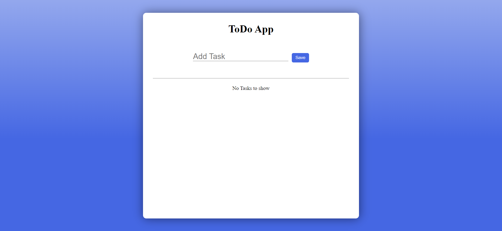
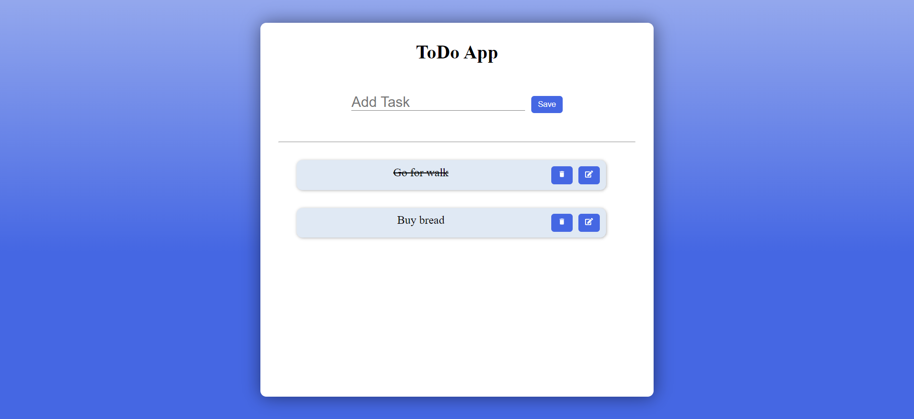

# ToDo App

This is a simple ToDo application built with React.

## Features

- Add new tasks
- Mark tasks as completed
- Delete tasks
- Edit tasks
- Save to localstorage

## Installation

1. Clone the repository:

2. Navigate to the project directory:

   ```bash
   cd todo
   ```

3. Install dependencies:

   ```bash
   npm install
   ```

## Usage

1. Start the development server:

   ```bash
   npm run dev
   ```

2. Open your browser and visit [http://localhost:5173/](http://localhost:5173/) to view the app.

## Technologies Used

- React
- JavaScript
- CSS

## Screenshots



