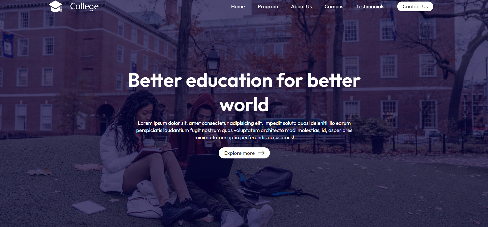

# University Website

This project is a React-based website for a university, showcasing various components like Navbar, Hero section, Programs, About section, Campus gallery, Testimonials, Contact form, and a Video Player.

## Table of Contents

- [University Website](#university-website)
  - [Table of Contents](#table-of-contents)
  - [Installation](#installation)
  - [Usage](#usage)
  - [Project Structure](#project-structure)
  - [Components](#components)
    - [App](#app)
    - [About](#about)
    - [Campus](#campus)
    - [Contact](#contact)
    - [Hero](#hero)
    - [Navbar](#navbar)
    - [Program](#program)
    - [Testimonial](#testimonial)
    - [Title](#title)
    - [Video Player](#video-player)
  - [Assets](#assets)
  - [Styling](#styling)
  - [API](#api)
  - [Screenshots](#screenshots)
    - [Home page](#home-page)
    - [Programs page](#programs-page)
    - [About us page](#about-us-page)
    - [Campus Gallery page](#campus-gallery-page)
    - [Testimonials page](#testimonials-page)
    - [Contact page](#contact-page)

## Installation

1. Clone the repository:

2. Install the dependencies:
   ```bash
   npm install
   ```

3. Start the development server:
   ```bash
   npm run dev
   ```

## Usage

After starting the development server, you can view the website in your browser at `http://localhost:3000`.

## Project Structure

The project structure is as follows:

```
university-website/
│
├── public/
│   └── index.html
│
├── src/
│   ├── assets/
│   │   ├── about.png
│   │   ├── back-icon.png
│   │   ├── dark-arrow.png
│   │   ├── gallery-1.png
│   │   ├── gallery-2.png
│   │   ├── gallery-3.png
│   │   ├── gallery-4.png
│   │   ├── logo.png
│   │   ├── menu-icon.png
│   │   ├── next-icon.png
│   │   ├── play-icon.png
│   │   ├── program-1.png
│   │   ├── program-2.png
│   │   ├── program-3.png
│   │   ├── program-icon-1.png
│   │   ├── program-icon-2.png
│   │   ├── program-icon-3.png
│   │   ├── user-1.png
│   │   ├── user-2.png
│   │   ├── user-3.png
│   │   ├── user-4.png
│   │   └── video.mp4
│   │
│   ├── components/
│   │   ├── About/
│   │   │   ├── About.js
│   │   │   └── about.css
│   │   ├── Campus/
│   │   │   ├── Campus.js
│   │   │   └── campus.css
│   │   ├── Contact/
│   │   │   ├── Contact.js
│   │   │   └── contact.css
│   │   ├── Hero/
│   │   │   ├── Hero.js
│   │   │   └── hero.css
│   │   ├── Navbar/
│   │   │   ├── Navbar.js
│   │   │   └── navbar.css
│   │   ├── Program/
│   │   │   ├── Program.js
│   │   │   └── program.css
│   │   ├── Testimonial/
│   │   │   ├── Testimonial.js
│   │   │   └── testimonial.css
│   │   ├── Title/
│   │   │   ├── Title.js
│   │   │   └── title.css
│   │   └── VideoPlayer/
│   │       ├── VideoPlayer.js
│   │       └── videoPlayer.css
│   │
│   ├── App.js
│   └── index.js
│
├── .gitignore
├── package-lock.json
├── package.json
└── README.md
```

## Components

### App

The main component that renders the entire application, integrating all other components.

### About

Displays information about the university with an option to play a video.

### Campus

Shows a gallery of campus images.

### Contact

Provides a form for users to contact the university.

### Hero

The main banner of the website, featuring a headline and a call-to-action button.

### Navbar

Contains the navigation menu, including links to various sections of the page.

### Program

Showcases the programs offered by the university.

### Testimonial

Displays user testimonials in a slider format.

### Title

A reusable component for section titles and subtitles.

### Video Player

Handles the video playback for the About section.

## Assets

The assets directory contains all the images, icons, and videos used in the project.

## Styling

Each component has its own CSS file for styling, located in the same directory as the component.

## API

The Contact component uses Web3Forms to handle form submissions. Ensure you replace the access key with your own in the Contact component in [Contact.jsx](https://github.com/ishwar-ikm/React-Projects/tree/main/1.%20ToDo) at line 13

```javascript
const formData = new FormData(event.target);
formData.append("access_key", "YOUR_ACCESS_KEY");
```

## Screenshots
### Home page

### Programs page

### About us page

### Campus Gallery page

### Testimonials page

### Contact page
