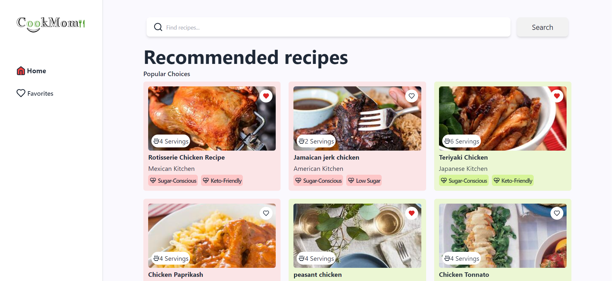
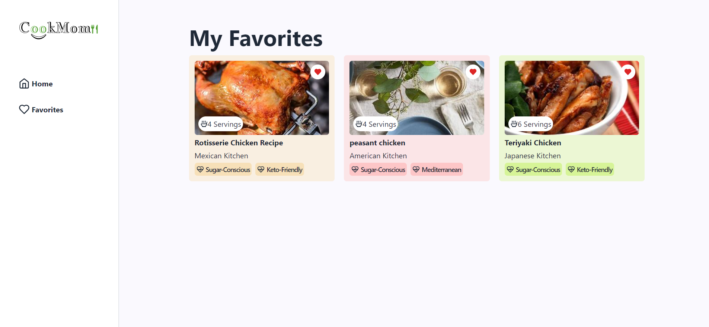

# Recipe Finder App

This is a web application built with React for searching and saving recipes. Users can search for recipes, view recommended recipes, and save their favorite recipes for future reference.

## Features

- **Search Recipes:** Users can search for recipes using keywords.
- **Recommended Recipes:** Displays popular and recommended recipes.
- **Favorites:** Allows users to save their favorite recipes locally.

## Technologies Used

- React
- React Router DOM
- Tailwind CSS
- Lucide Icons
- Edamam Recipe API

## Installation

1. Clone the repository:

2. Install dependencies:
   ```bash
   npm install
   ```

3. Create a `.env` file in the root directory and add your Edamam API credentials:
   ```dotenv
   VITE_APP_ID=your_api_id
   VITE_APP_KEY=your_api_key
   ```

4. Start the development server:
   ```bash
   npm start
   ```

5. Open `http://localhost:5173` to view the app in the browser.

## Screenshots

- **Home Page:**
  

- **Favorites Page:**
  

## Usage

- Enter a search query in the search bar on the home page to find recipes.
- Click on the heart icon on recipe cards to add them to your favorites.
- Navigate between Home and Favorites using the sidebar or bottom navigation on smaller screens.
